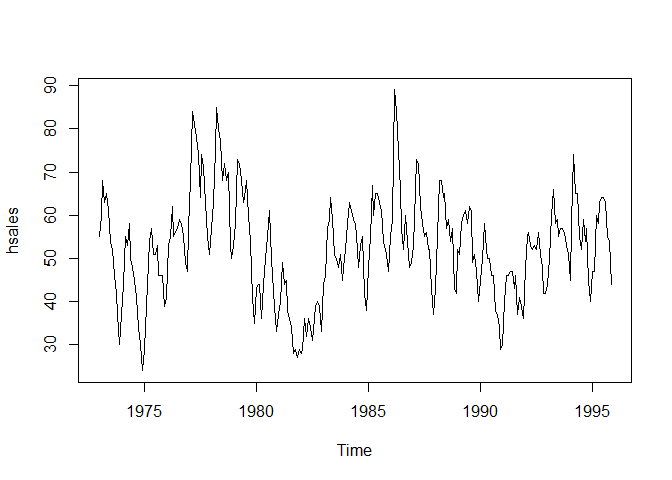
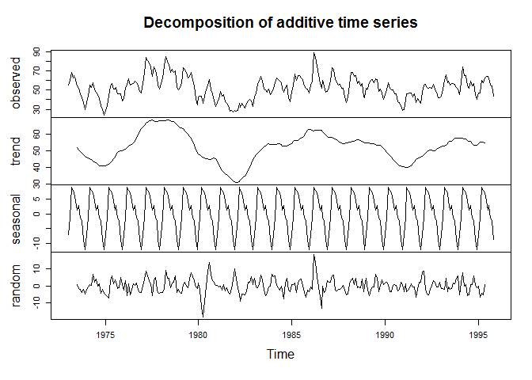
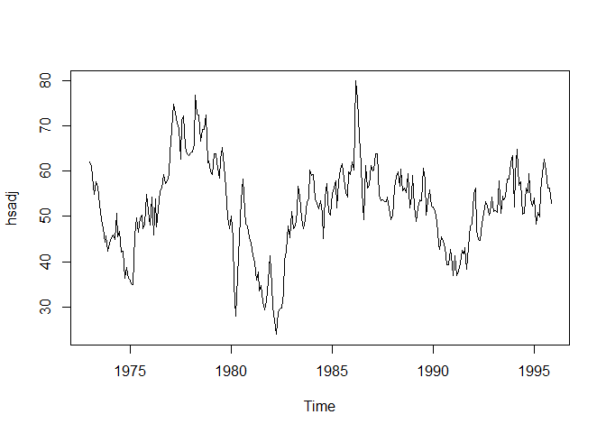
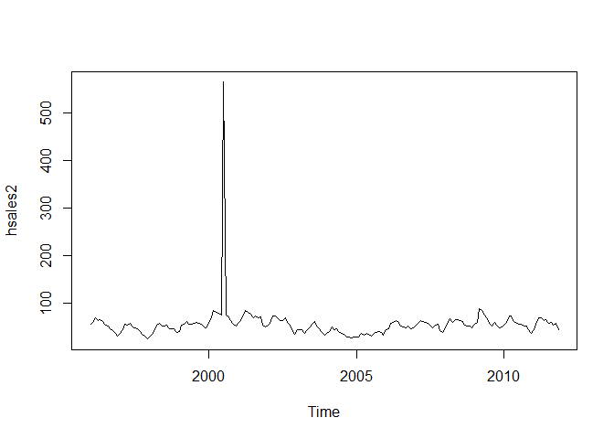
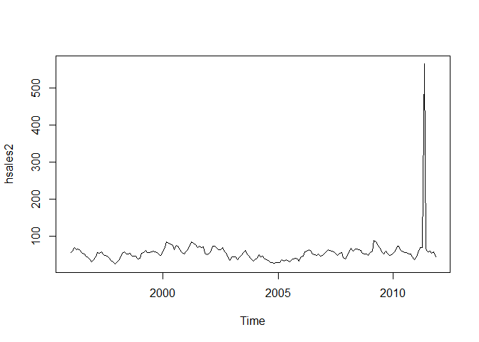
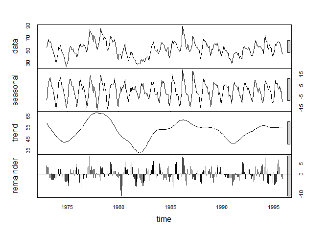
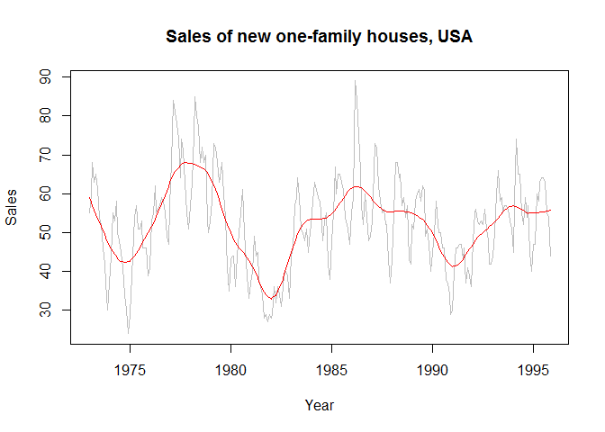

# MSDS 6306 Live Session #11
Jim Brittain  
November 20, 2016  


More examples of forecasting!
Code to load data:
library(fpp) #fpp package must be installed first


```r
library(fpp) #fpp package must be installed first
```

```
## Warning: package 'fpp' was built under R version 3.3.2
```

```
## Loading required package: forecast
```

```
## Warning: package 'forecast' was built under R version 3.3.2
```

```
## Loading required package: zoo
```

```
## 
## Attaching package: 'zoo'
```

```
## The following objects are masked from 'package:base':
## 
##     as.Date, as.Date.numeric
```

```
## Loading required package: timeDate
```

```
## Warning: package 'timeDate' was built under R version 3.3.2
```

```
## This is forecast 7.3
```

```
## Loading required package: fma
```

```
## Warning: package 'fma' was built under R version 3.3.2
```

```
## Loading required package: tseries
```

```
## Warning: package 'tseries' was built under R version 3.3.2
```

```
## Loading required package: expsmooth
```

```
## Warning: package 'expsmooth' was built under R version 3.3.2
```

```
## Loading required package: lmtest
```

# Bring in HSALES dataset. 
(HSALES data set assigned to our group in class)
This is data of Monthly sales of new one-family houses sold in the USA since 1973.
http://search.r-project.org/library/fma/html/hsales.html


```r
data(hsales)
hsales
```

```
##      Jan Feb Mar Apr May Jun Jul Aug Sep Oct Nov Dec
## 1973  55  60  68  63  65  61  54  52  46  42  37  30
## 1974  37  44  55  53  58  50  48  45  41  34  30  24
## 1975  29  34  44  54  57  51  51  53  46  46  46  39
## 1976  41  53  55  62  55  56  57  59  58  55  49  47
## 1977  57  68  84  81  78  74  64  74  71  63  55  51
## 1978  57  63  75  85  80  77  68  72  68  70  53  50
## 1979  53  58  73  72  68  63  64  68  60  54  41  35
## 1980  43  44  44  36  44  50  55  61  50  46  39  33
## 1981  37  40  49  44  45  38  36  34  28  29  27  29
## 1982  28  29  36  32  36  34  31  36  39  40  39  33
## 1983  44  46  57  59  64  59  51  50  48  51  45  48
## 1984  52  58  63  61  59  58  52  48  53  55  42  38
## 1985  48  55  67  60  65  65  63  61  54  52  51  47
## 1986  55  59  89  84  75  66  57  52  60  54  48  49
## 1987  53  59  73  72  62  58  55  56  52  52  43  37
## 1988  43  55  68  68  64  65  57  59  54  57  43  42
## 1989  52  51  58  60  61  58  62  61  49  51  47  40
## 1990  45  50  58  52  50  50  46  46  38  37  34  29
## 1991  30  40  46  46  47  47  43  46  37  41  39  36
## 1992  48  55  56  53  52  53  52  56  51  48  42  42
## 1993  44  50  60  66  58  59  55  57  57  56  53  51
## 1994  45  58  74  65  65  55  52  59  54  57  45  40
## 1995  47  47  60  58  63  64  64  63  55  54  44
```

1)	Go through the electric equipment example with assigned dataset (HSALES). 

1a)	Plot the time series. 


```r
plot(hsales)
```

<!-- -->

Can you identify seasonal fluctuations and/or a trend? 

### Yes, you can see a high and low within each year on the time series plot.


1b)	Use a classical decomposition to calculate the trend-cycle and seasonal indices. 


```r
hsfitd <- decompose(hsales)
plot(hsfitd)
```

<!-- -->

1c)	Do the results support the graphical interpretation from part (a)? 

### Yes, the results show the various graphs and present more insite to the original graph.


1d)	Compute and plot the seasonally adjusted data. 


```r
hsadj <- seasadj(hsfitd)
plot(hsadj)
```

<!-- -->

1e)	Change one observation to be an outlier (e.g., add 500 to one observation), and recompute the seasonally adjusted data.


```r
hsales2 <- ts(c(hsales[1:54],hsales[55]+500,hsales[56:191]),start=c(1996,1),frequency=12)
plot(hsales2)
```

<!-- -->

```r
hsales2 <- ts(c(hsales[1:184],hsales[185]+500,hsales[186:191]),start=c(1996,1),frequency=12)
plot(hsales2)
```

<!-- -->

What is the effect of the outlier? 

### The outlier pushes the entire graph down to the bottom where it is harder to see the trend in detail because the Y axis legend gets compressed.  It also affects the values close to it and bumps the trend for a few months.


1f)	Does it make any difference if the outlier is near the end rather than in the middle of the time series? 

### If the outlier was at the end it would have less effect on the general trend but could throw predicted outcomes off because there would not be as many values after it to correct it and pull it back.


1g)	Use STL to decompose the series. 


```r
hsfit <- stl(hsales, s.window=5)
plot(hsfit)
```

<!-- -->


Additional example modifications to the plot to add to the readability 
and add the fit line over the original plot

```r
plot(hsales, col="gray",
  main="Sales of new one-family houses, USA",
  ylab="Sales", xlab="Year")
lines(hsfit$time.series[,2],col="red",ylab="Trend")
```

<!-- -->

